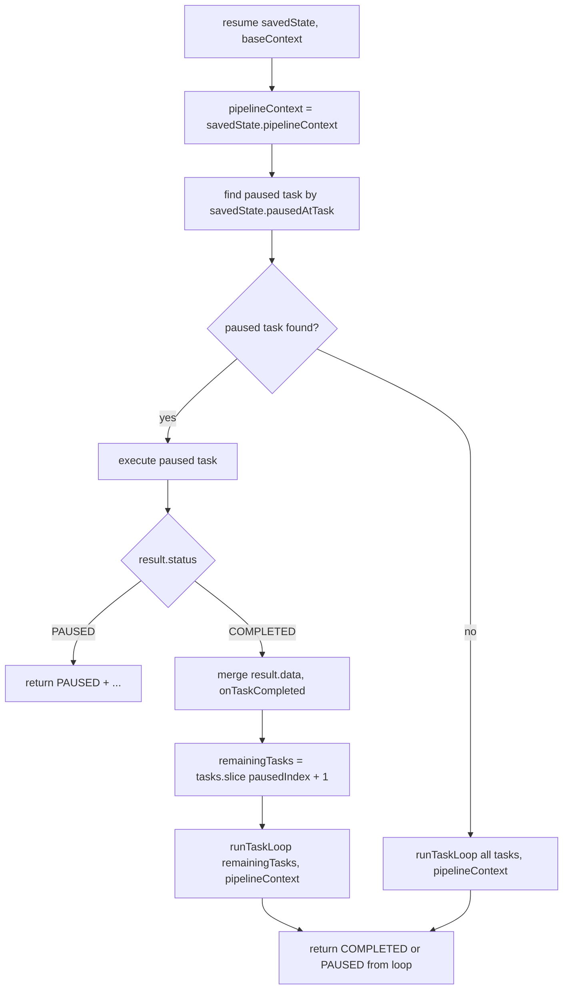
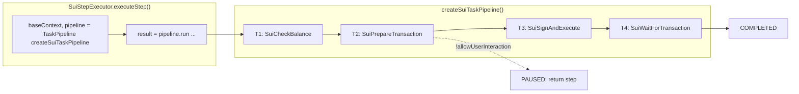

# Task Pipeline

How the task pipeline works in the SDK: types, flow, and current implementation (Sui, Ethereum).

## Overview

The **TaskPipeline** runs a list of **ExecutionTask**s in order. Each task can:

- **Skip** itself via `shouldRun(context) → false`
- **Complete** and optionally return `result.data` (merged into **PipelineContext** for later tasks)
- **Pause** and return `status: 'PAUSED'` so execution can be resumed later with `pipeline.resume()`

Status is updated inside tasks via e.g. **StatusManager** on the context (ecosystem-specific fields are merged at top level).

---

## Types (summary)

| Type | Role |
|------|------|
| **ExecutionTask** | `type`, `displayName`, `shouldRun`, `execute` |
| **TaskContext** | `TaskContextBase & TExtra`: base fields + ecosystem fields at top level (no `extra` key) |
| **TaskResult** | `status: 'COMPLETED' \| 'PAUSED'`, optional `data`, optional `saveState` |
| **TaskState** | `taskType`, `phase`, `data` — optional state a task can return when pausing (not persisted) |
| **PipelineContext** | Accumulated key-value data from completed tasks (e.g. `signedPermits`, `preparedTransaction`) |
| **PipelineSavedState** | `pausedAtTask`, `pipelineContext` — input to `resume()` |
| **PipelineResult** | Either `{ status: 'COMPLETED', pipelineContext }` or `{ status: 'PAUSED', pausedAtTask, pipelineContext }` |

---

## Diagram: `run()` flow

`run()` delegates to an internal **runTaskLoop(tasksToRun, pipelineContext, baseContext)** which runs the given task list in sequence.

```mermaid
flowchart TD
    A[run baseContext] --> B[runTaskLoop all tasks, context = empty]
    B --> C[for each task in tasksToRun]
    C --> D[context = { ...baseContext, ...pipelineContext, pipelineContext }]
    D --> E["shouldRun(context)"]
    E -->|false| F[onTaskSkipped, continue]
    F --> C
    E -->|true| G[onTaskStarted]
    G --> H[result = task.execute context]
    H --> I["result.status?"]
    I -->|PAUSED| J[return PAUSED with pausedAtTask, pipelineContext]
    I -->|COMPLETED| K[merge result.data into pipelineContext]
    K --> L[onTaskCompleted]
    L --> C
    C -->|no more tasks| M[return COMPLETED with pipelineContext]
```

---

## Diagram: `resume()` flow

Resume finds the paused task by type, re-executes it (no shouldRun), then runs the **remaining tasks** via the same **runTaskLoop** used by run().



---

## Diagram: Sui task sequence (current pipeline)



| Task | type | shouldRun | execute / writes |
|------|------|-----------|-------------------|
| T1 | SuiCheckBalance | !txHash && status !== DONE | updateAction(..., 'STARTED'); checkBalance(...) |
| T2 | SuiPrepareTransaction | !txHash && status !== DONE | getStepTransaction, stepComparison → **preparedTransaction**; updateAction(..., 'ACTION_REQUIRED'); if !allowUserInteraction → **PAUSED** |
| T3 | SuiSignAndExecute | !txHash && status !== DONE | sign + execute → **suiTxDigest** |
| T4 | SuiWaitForTransaction | txHash present, status !== DONE | wait confirmation; DONE for bridge |

After the pipeline completes, **SuiStepExecutor** calls `waitForDestinationChainTransaction(...)` outside the pipeline, then returns the step.

---

## Pipeline pattern for other ecosystems

### Common task shape across ecosystems

All ecosystems share a similar sequence:

1. **StartAction** – Init execution, resolve chains, find/create action, set type (CROSS_CHAIN / SWAP), update status to STARTED.
2. **CheckWallet / SwitchChain** (optional) – Ensure correct chain and wallet; fail if wallet/address mismatch.
3. **CheckBalance** – Ensure user has sufficient balance before preparing the transaction.
4. **PrepareTransaction** – Fetch step transaction (getStepTransaction or ecosystem-specific), stepComparison, build transactionRequest, apply updateTransactionRequestHook.
5. **AwaitUserSignature** (pause boundary) – Set action to ACTION_REQUIRED; if `!allowUserInteraction` return **PAUSED** + saveState.
6. **SignAndExecute** – Sign (and possibly simulate), send/broadcast, update action to PENDING with txHash/taskId/txLink.
7. **WaitForTransaction** – Wait for confirmation; handle replacement/cancel; mark action DONE for bridge.
8. **WaitForDestinationChain** – waitForDestinationChainTransaction (can be last task or called after pipeline).

Ecosystems differ in **context shape** (wallet, statusManager, relayer/batch/permit flags at top level), **resume path** (e.g. when `action.txHash` already exists), and **SignAndExecute** (single tx vs batched vs relayer).

---

### Bitcoin

| # | Task (conceptual) | Notes |
|---|--------------------|--------|
| 1 | BitcoinStartActionTask | Init execution, find/create action; resume path when `action.txHash` → skip to WaitForTransaction. |
| 2 | BitcoinCheckWalletTask | Verify wallet matches quote; used on resume path and before sign. |
| 3 | BitcoinCheckBalanceTask | checkBalance before preparing tx. |
| 4 | BitcoinPrepareTransactionTask | getStepTransaction, stepComparison; then transactionRequest + updateTransactionRequestHook; PSBT input enrichment (tapInternalKey, sighashType, redeemScript) lives in SignAndExecute. |
| 5 | BitcoinAwaitUserSignatureTask | ACTION_REQUIRED; **PAUSED** if `!allowUserInteraction`. |
| 6 | BitcoinSignAndExecuteTask | signPsbt (with timeout), finalize, sendUTXOTransaction, update PENDING (txHash, txLink, txHex). |
| 7 | BitcoinWaitForTransactionTask | waitForTransaction, onReplaced, replacementReason; DONE for bridge. |
| 8 | WaitForDestinationChainTask | waitForDestinationChainTransaction (pollingInterval 10_000). |

**Resume path:** When `action.txHash` is set, only CheckWallet and WaitForTransaction (and destination) run; no new tx is created.

---

### Solana

| # | Task (conceptual) | Notes |
|---|--------------------|--------|
| 1 | SolanaCheckBalanceTask | updateAction(..., 'STARTED'); checkBalance(...). Context from **getSolanaPipelineContext()** (chains, wallet account, find/create action). |
| 2 | SolanaPrepareTransactionTask | getStepTransaction, stepComparison; updateAction(..., 'ACTION_REQUIRED'); if !allowUserInteraction → **PAUSED**. |
| 3 | SolanaSignAndExecuteTask | updateTransactionRequestHook; base64 decode, sign (with timeout), decode signed tx, simulate (callSolanaWithRetry), sendAndConfirmTransaction; update PENDING (txHash, txLink), DONE for bridge. |
| (after pipeline) | SolanaStepExecutor | Calls **waitForDestinationChainTransaction(...)** after pipeline completes, then returns step. |

**Ecosystem specifics:** **baseContext** from **getSolanaPipelineContext()** (returns context with walletAccount). Resume: executor persists **pipelineSavedState** and calls **pipeline.resume()** on next executeStep. “already have txHash” shortcut in the current Solana executor; a pipeline version could skip to a “wait” task when `action.txHash` exists (similar to Bitcoin).

---

### Ethereum

| # | Task (conceptual) | Notes |
|---|--------------------|--------|
| 1 | EthereumDestinationChainCheckTask | When RECEIVING_CHAIN action exists and not WAIT_DESTINATION_TRANSACTION: checkClient(step, destinationChainAction). |
| 2 | EthereumCheckAllowanceTask | checkAllowance (approval / permit / batch); can return PAUSED if `!allowUserInteraction` and interaction needed. |
| 3 | EthereumCheckBalanceTask | updateAction(..., 'STARTED'); checkBalance(...). Context from **getEthereumPipelineContext()** (chains, batching/permit2 flags, find/create action). |
| 4 | EthereumPrepareTransactionTask | prepareUpdatedStep; updateAction(..., 'ACTION_REQUIRED'); if !allowUserInteraction → **PAUSED**; else returns **result.data** (transactionRequest, isRelayerTransaction) merged into pipelineContext. |
| 5 | EthereumSignAndExecuteTask | Batched (sendCalls), relayer (sign typed data, relayTransaction), or standard (permit, signPermit2, estimateTransactionRequest, sendTransaction). Reads transactionRequest/isRelayerTransaction from context (from pipelineContext merge). |
| 6 | EthereumWaitForTransactionTask | waitForTransaction (batch / relayed / standard receipt), DONE for bridge. |
| (after pipeline) | EthereumStepExecutor | Calls **waitForDestinationChainTransaction(...)** after pipeline completes, then returns step. |

**Ecosystem specifics:** **baseContext** is built by **getEthereumPipelineContext()** (returns context object directly). Context carries batchingSupported, permit2Supported, signedTypedData, toChain, isBridgeExecution, action (from statusManager), etc. Resume: executor persists **pipelineSavedState** on step and calls **pipeline.resume()** on next executeStep. 
---

## Data flow

```
  baseContext (from executor)          pipelineContext (internal)
  ─────────────────────────           ──────────────────────────
  client                               {} at start
  step                                 ← task result.data merged here
  chain                                (e.g. transactionRequest, isRelayerTransaction)
  allowUserInteraction
  ecosystem fields (e.g. EthereumTaskExtra / SuiTaskExtra)
  ─────────────────────────           ──────────────────────────
  TaskContext = { ...baseContext, ...pipelineContext, pipelineContext }
  So merged result.data is at top level; each task receives TaskContext and can return data to merge.
```

---

## Current usage: resume wired (Sui, Ethereum)

- **SuiStepExecutor** and **EthereumStepExecutor** wire resume by persisting `PipelineSavedState` on **`step.execution.pipelineSavedState`** when `run()` returns `status: 'PAUSED'`, and on the next `executeStep` they call **`pipeline.resume(savedState, baseContext)`** when that field is set, then clear it after a successful run.
- **Ethereum:** **baseContext** is obtained via **`getEthereumPipelineContext(client, step, atomicityNotReady, deps)`**, which returns the context object directly (no wrapper).
- **`prepareRestart(route)`** does **not** clear `step.execution.pipelineSavedState`, so resume state survives across restart/resume.
- **SolanaStepExecutor** wires resume the same way (persists **pipelineSavedState**, calls **pipeline.resume()** on next executeStep); **baseContext** from **getSolanaPipelineContext()**.
- Bitcoin executor still only uses **`pipeline.run(...)`** and does not yet persist or use pipeline saved state.

### Call chain (current)

```
App → executeRoute(client, route) or resumeRoute(client, route)
  → executionState.create({ route, executionOptions })  [or get existing]
  → executeSteps(client, route)
       → for each step: stepExecutor.executeStep(client, step)
            → new TaskPipeline(tasks); pipeline.run(baseContext) or pipeline.resume(savedState, baseContext) when step.execution.pipelineSavedState is set
            → returns step  (execution layer only sees the step, not PipelineResult)
       → if step.execution?.status !== 'DONE' → stopRouteExecution(route)  [deletes executionState]
```

When the user continues, the app calls **resumeRoute(route)**. Because **stopRouteExecution** has already deleted the entry from `executionState`, `resumeRoute` calls **prepareRestart(route)** then **executeRoute** again. **executeSteps** runs again and calls **executeStep(client, step)** for the same step. The **step** (and **route**) reference is the same object the app holds; only in-memory execution state was cleared. The executor sees `step.execution.pipelineSavedState` and calls **`pipeline.resume(...)`** instead of **`pipeline.run(...)`**.
