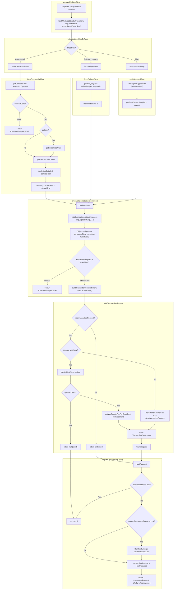

# prepareUpdatedStep flow

## Step type dispatch

| Condition | Helper | What it does |
|-----------|--------|----------------|
| `isContractCallStep(step)` | `fetchContractCallStep` | Get contract calls (optional patch) → quote → route step |
| `isRelayerStep(step) && isGaslessStep(step)` | `fetchRelayerStep` | Get relayer quote for gasless execution |
| Else | `fetchStandardStep` | getStepTransaction with optional signed typed data |

## Return values

- **prepareUpdatedStep**: `{ transactionRequest, isRelayerTransaction }` or `null` (abort when checkClient fails).
- **buildTransactionRequest**: `undefined` (no tx request), `null` (abort), or `TransactionParameters`.
