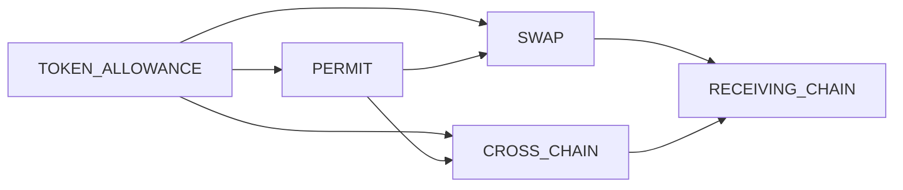
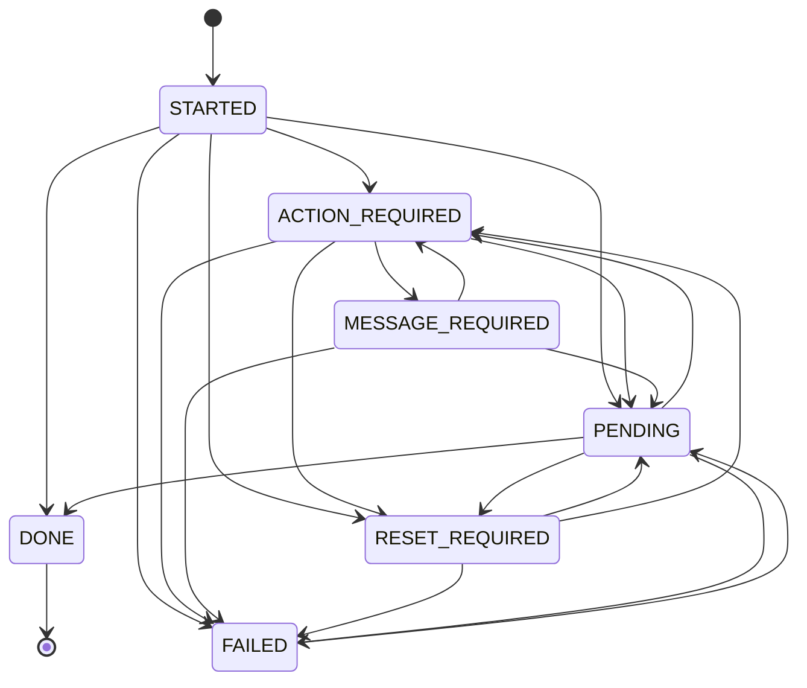
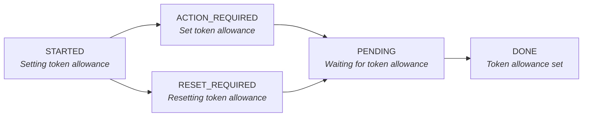
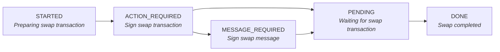
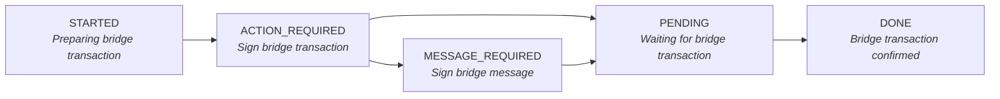
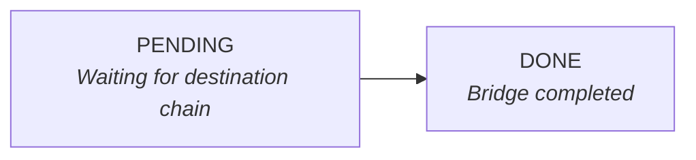
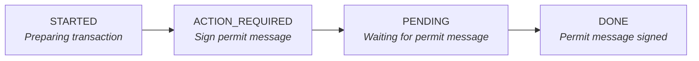
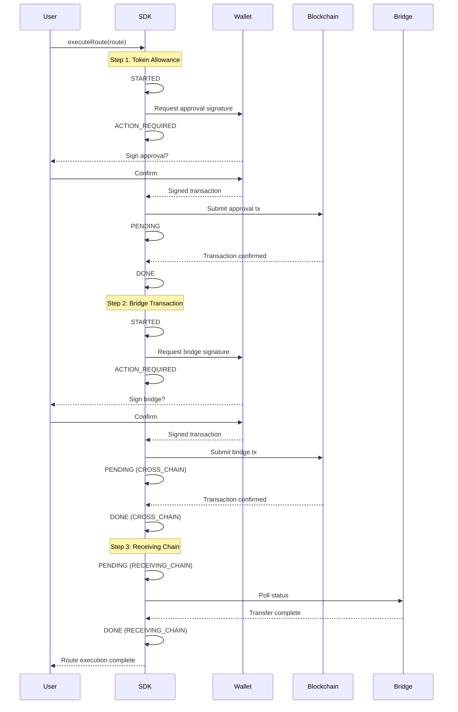
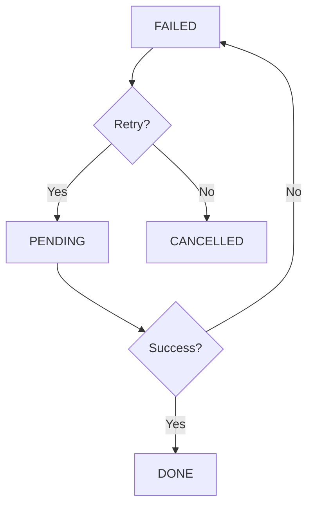

# SDK Execution Flow

This document explains how route execution works in the LI.FI SDK, including status transitions and transaction types.

## Transaction Types

Each step in a route goes through one or more transaction types in sequence:

| Type | Description |
|------|-------------|
| `TOKEN_ALLOWANCE` | Setting ERC-20 token approval for the contract |
| `PERMIT` | Signing a gasless permit message (ERC-2612) |
| `SWAP` | On-chain swap transaction |
| `CROSS_CHAIN` | Bridge transaction to another chain |
| `RECEIVING_CHAIN` | Waiting for tokens on destination chain |

## Execution Statuses

Each transaction type goes through these statuses:

| Status | Description |
|--------|-------------|
| `STARTED` | Transaction is being prepared |
| `ACTION_REQUIRED` | User needs to sign a transaction |
| `MESSAGE_REQUIRED` | User needs to sign a message |
| `RESET_REQUIRED` | Token approval needs to be reset to 0 first |
| `PENDING` | Waiting for transaction confirmation |
| `DONE` | Transaction completed successfully |
| `FAILED` | Transaction failed (can retry) |

## Status Messages by Transaction Type

### TOKEN_ALLOWANCE

### SWAP

### CROSS_CHAIN

### RECEIVING_CHAIN

> **Note:** `RECEIVING_CHAIN` has no `STARTED` status because it's a passive waiting phase.

### PERMIT

## Full Execution Flow

A typical cross-chain swap execution:

## Error Recovery

When a transaction fails:
1. Status moves to `FAILED`
2. User can retry with `resumeRoute()`
3. Status transitions back to `PENDING`
4. If successful, moves to `DONE`
5. If it fails again, returns to `FAILED`

## Related Files

- `src/core/execution.ts` - Main execution logic
- `src/core/statusManager/StatusManager.ts` - Status management
- `src/core/statusManager/transitions.ts` - Valid state transitions
- `src/core/processMessages.ts` - Status messages
- `src/types/core.ts` - Type definitions
