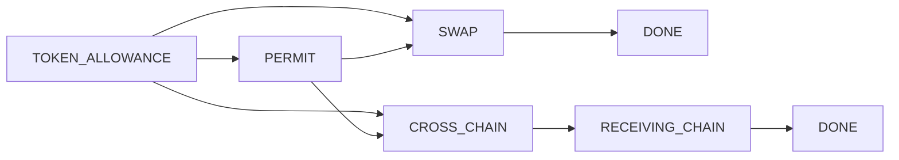
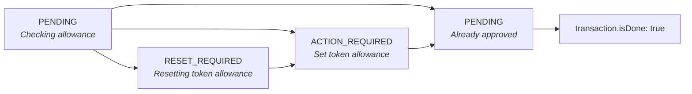
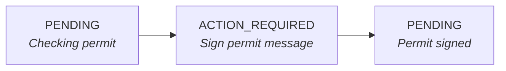
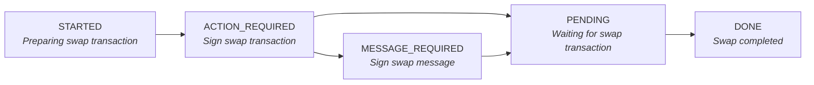
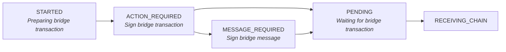
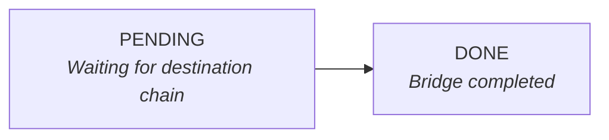

# SDK Execution Flow

This document explains how route execution works in the LI.FI SDK, including status transitions, transaction types, and function flows.

## Transaction Types

Each step in a route goes through one or more transaction types in sequence:



| Type | Description | Chains |
|------|-------------|--------|
| `TOKEN_ALLOWANCE` | Setting ERC-20 token approval for the contract | EVM only |
| `PERMIT` | Signing a gasless permit message (ERC-2612) | EVM only |
| `SWAP` | On-chain swap transaction | All |
| `CROSS_CHAIN` | Bridge transaction to another chain | All |
| `RECEIVING_CHAIN` | Waiting for tokens on destination chain | All (bridges) |

### Transaction Object

Each transaction in `execution.transactions` has:

```typescript
type Transaction = {
  type: TransactionType      // Which phase this transaction belongs to
  chainId?: number           // Chain where the transaction was submitted
  isDone?: boolean           // Whether this transaction is complete
  txHash?: string            // On-chain transaction hash
  taskId?: string            // Relayer task ID (for relayed transactions)
  txLink?: string            // Block explorer link
  txType?: TransactionMethodType  // 'standard' | 'relayed' | 'batched'
  txHex?: string             // Raw transaction hex (Bitcoin)
}
```

The `isDone` flag is the source of truth for transaction completion:
- `isDone: false` — Transaction submitted but not confirmed
- `isDone: true` — Transaction confirmed on-chain

## Status Flows by Transaction Type

### TOKEN_ALLOWANCE (EVM only)


> **Note:** `TOKEN_ALLOWANCE` does not use `STARTED` status. It begins with `PENDING`.

### PERMIT (EVM only)


> **Note:** `PERMIT` does not use `STARTED` status. It begins with `PENDING`.

### SWAP


### CROSS_CHAIN


### RECEIVING_CHAIN


> **Note:** `RECEIVING_CHAIN` has no `STARTED` status because it's a passive waiting phase.

## Simplified Flow with Status Transitions

```
┌──────────────────────────────────────────────────────────────────────────────┐
│ executeRoute()                                                                │
│   └── executeSteps()                                                          │
│         └── for each step:                                                    │
│               └── stepExecutor.executeStep()                                  │
│                     │                                                         │
│                     ├─► initExecution(step, type)  // Initialize/reset        │
│                     │   └─► Sets status: STARTED for main type                │
│                     │                                                         │
│                     │  ┌────────────────────────────────────────────────────┐ │
│                     ├─►│ TOKEN_ALLOWANCE (EVM only, no STARTED)             │ │
│                     │  │   PENDING → ACTION_REQUIRED → PENDING              │ │
│                     │  │   transaction: { isDone: true }                    │ │
│                     │  │   (or PENDING → PENDING if already approved)       │ │
│                     │  │   (or PENDING → RESET_REQUIRED → ... → PENDING)    │ │
│                     │  └────────────────────────────────────────────────────┘ │
│                     │                                                         │
│                     │  ┌────────────────────────────────────────────────────┐ │
│                     ├─►│ PERMIT (EVM only, optional, no STARTED)            │ │
│                     │  │   PENDING → ACTION_REQUIRED → PENDING              │ │
│                     │  └────────────────────────────────────────────────────┘ │
│                     │                                                         │
│                     │  ┌────────────────────────────────────────────────────┐ │
│                     ├─►│ SWAP or CROSS_CHAIN                                │ │
│                     │  │   STARTED → ACTION_REQUIRED → PENDING              │ │
│                     │  │   (or → MESSAGE_REQUIRED → PENDING)                │ │
│                     │  │   transaction: { isDone: true } for swaps          │ │
│                     │  │   transaction: { isDone: false } for bridges       │ │
│                     │  └────────────────────────────────────────────────────┘ │
│                     │                                                         │
│                     │  ┌────────────────────────────────────────────────────┐ │
│                     └─►│ RECEIVING_CHAIN (bridges only, no STARTED)         │ │
│                        │   PENDING → DONE                                   │ │
│                        │   transaction: { isDone: true }                    │ │
│                        └────────────────────────────────────────────────────┘ │
└──────────────────────────────────────────────────────────────────────────────┘
```

> **Note:** Only `SWAP` and `CROSS_CHAIN` use `STARTED` status (set by `initExecution`). `TOKEN_ALLOWANCE`, `PERMIT`, and `RECEIVING_CHAIN` skip `STARTED` and begin with `PENDING`.

> **Note:** `DONE` status is only set once at the end of the entire step execution. Individual transactions track completion via the `isDone` flag.

## Ethereum Execution Flow

### EthereumStepExecutor.executeStep()

```
executeStep(client, step)
│
├─► initExecution(step, executionType)     // Initialize or reset execution
│   └─► Sets status: 'STARTED', clears state if FAILED
│
├─► checkClient()                          // Ensure correct chain & wallet
│   └─► switchChain()                      // Switch if needed
│
├─► checkAllowance()                       // TOKEN_ALLOWANCE phase
│   │
│   │   ┌─────────────────────────────────────────────────────────────┐
│   │   │ TOKEN_ALLOWANCE Flow (no STARTED status)                    │
│   │   ├─────────────────────────────────────────────────────────────┤
│   │   │ updateExecution(step, { type: 'TOKEN_ALLOWANCE', status: 'PENDING' })│
│   │   │         │                                                   │
│   │   │         ├─► getAllowance()                                  │
│   │   │         │   └─► If approved → status: PENDING (skip)        │
│   │   │         │                                                   │
│   │   │         ├─► updateExecution(step, { status: 'RESET_REQUIRED' })│
│   │   │         │   └─► setAllowance(0)  // Reset if needed         │
│   │   │         │                                                   │
│   │   │         ├─► updateExecution(step, { status: 'ACTION_REQUIRED' })│
│   │   │         │   └─► setAllowance()   // User signs approval tx  │
│   │   │         │                                                   │
│   │   │         └─► waitForTransactionReceipt()                     │
│   │   │             └─► status: PENDING, transaction: { isDone: true }│
│   │   └─────────────────────────────────────────────────────────────┘
│   │
│   │   ┌─────────────────────────────────────────────────────────────┐
│   │   │ PERMIT Flow (no STARTED status)                             │
│   │   ├─────────────────────────────────────────────────────────────┤
│   │   │ updateExecution(step, { type: 'PERMIT', status: 'PENDING' })│
│   │   │ updateExecution(step, { status: 'ACTION_REQUIRED' })        │
│   │   │         │                                                   │
│   │   │         └─► signTypedData()  // User signs permit message   │
│   │   │             └─► status: PENDING                             │
│   │   └─────────────────────────────────────────────────────────────┘
│
├─► updateExecution(step, { type: 'SWAP' | 'CROSS_CHAIN', status: 'STARTED' })
│
├─► checkBalance()                         // Verify sufficient balance
│
├─► prepareUpdatedStep()                   // Get transaction request
│   ├─► getStepTransaction()               // API call for tx data
│   ├─► getContractCallsQuote()            // For contract calls
│   └─► getRelayerQuote()                  // For relayer transactions
│
├─► updateExecution(step, { status: 'ACTION_REQUIRED' })
│
├─► [User Interaction Required]
│   │
│   ├─► For Batched Transactions (EIP-5792):
│   │   └─► sendCalls()
│   │
│   ├─► For Relayer Transactions:
│   │   ├─► status: MESSAGE_REQUIRED
│   │   ├─► signTypedData()                // Sign intent
│   │   ├─► status: PENDING
│   │   └─► relayTransaction()             // Submit to relayer
│   │
│   └─► For Standard Transactions:
│       ├─► signPermit2Message()           // If permit2 supported
│       │   └─► status: MESSAGE_REQUIRED → ACTION_REQUIRED
│       └─► sendTransaction()              // User signs & submits
│
├─► updateExecution(step, { status: 'PENDING', transaction: { txHash } })
│
└─► waitForTransaction()
    │
    ├─► waitForTransactionReceipt()        // Wait for source chain confirm
    │   └─► For non-bridge: status: DONE
    │
    └─► waitForDestinationChainTransaction()  // For bridges only
        │
        ├─► updateExecution(step, { type: 'RECEIVING_CHAIN', status: 'PENDING', ... })
        │
        └─► waitForTransactionStatus()     // Poll API for bridge status
            │
            ├─► getStatus()                // API call
            │   └─► Loop until DONE or FAILED
            │
            └─► status: DONE or FAILED
```

## Solana Execution Flow

### SolanaStepExecutor.executeStep()

```
executeStep(client, step)
│
├─► initExecution(step, executionType)     // Initialize or reset execution
│
├─► checkBalance()                         // Verify SOL/token balance
│
├─► getStepTransaction()                   // Get transaction from API
│
├─► updateExecution(step, { type, status: 'ACTION_REQUIRED' })
│
├─► getWalletFeature(wallet, SolanaSignTransaction)
│   └─► signTransaction()                  // User signs in wallet
│
├─► updateExecution(step, { type, status: 'PENDING' })
│
├─► sendAndConfirmTransaction()            // Submit to Solana network
│   ├─► rpc.sendTransaction()
│   └─► waitForTransactionConfirmation()
│
├─► updateExecution(step, { type, status: 'PENDING', transaction: { txHash, isDone } })
│
└─► [If Bridge]
    └─► waitForDestinationChainTransaction()
        └─► status: DONE, transaction: { type: 'RECEIVING_CHAIN', isDone: true }
```

## Sui Execution Flow

### SuiStepExecutor.executeStep()

```
executeStep(client, step)
│
├─► initExecution(step, executionType)     // Initialize or reset execution
│
├─► checkBalance()                         // Verify SUI/token balance
│
├─► getStepTransaction()                   // Get transaction from API
│
├─► updateExecution(step, { type, status: 'ACTION_REQUIRED' })
│
├─► wallet.signAndExecuteTransaction()     // User signs & executes
│
├─► updateExecution(step, { type, status: 'PENDING' })
│
├─► client.waitForTransaction()            // Wait for confirmation
│
├─► updateExecution(step, { type, status: 'PENDING', transaction: { txHash, isDone } })
│
└─► [If Bridge]
    └─► waitForDestinationChainTransaction()
        └─► status: DONE, transaction: { type: 'RECEIVING_CHAIN', isDone: true }
```
