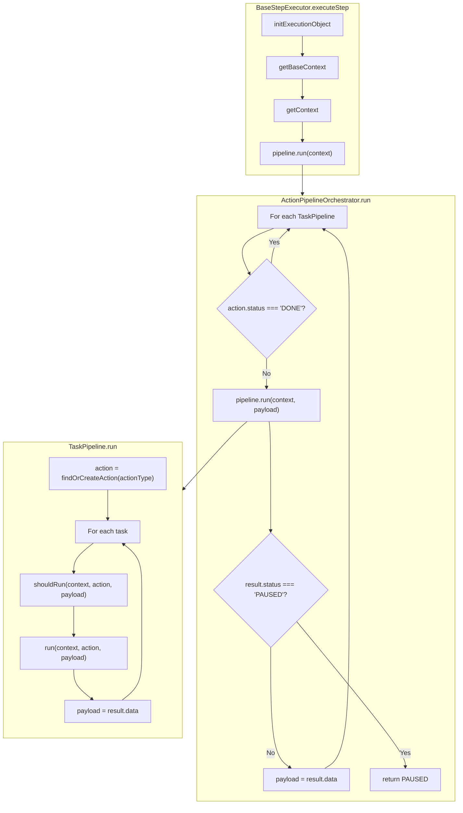

# Step Execution Architecture

This document describes the action-centric execution architecture used to run a single step (e.g. swap or bridge) in a route.

## Overview

- **Action-centric**: Execution is driven by **actions** (e.g. `TOKEN_ALLOWANCE`, `SWAP`/`CROSS_CHAIN`, `RECEIVING_CHAIN`). Each action has its own **pipeline of tasks**. No pause state is stored; on each `executeStep` call we walk the list of action pipelines and run the first one whose action is not yet `DONE`.
- **Tasks**: Each task can `shouldRun` (skip) or `run`, and may return `PAUSED` (e.g. waiting for user signature) or `COMPLETED` with optional `data` for the next task.
- **Payload handoff**: Tasks pass data to the next task via `TaskResult.data`. The pipeline forwards this as the `payload` argument to the next task’s `shouldRun` and `run`.

---

## High-level flow

```
executeStep(client, step)
    → init execution, getContext()
    → context.pipeline.run(context)
        → ActionPipelineOrchestrator.run(context)
            → for each TaskPipeline (by action type):
                if action.status === 'DONE' → skip
                else → pipeline.run(context, payload)
                    → for each task: shouldRun → run → payload = result.data
                    → if PAUSED → return; else continue
            → payload flows to next pipeline
    → return step
```

---

## Components

### 1. BaseStepExecutor

- **Role**: Base class for chain-specific step executors (Ethereum, Solana, Sui, Bitcoin).
- **Flow**:
  1. `initExecutionObject(step)` to ensure `step.execution` exists.
  2. `getBaseContext(client, step)` → chains, step, statusManager, flags, etc.
  3. `getContext(baseContext)` → provider adds pipeline + extra (e.g. `ethereumClient`, `parseErrors`).
  4. `context.pipeline.run(context)` → runs the full action-based pipeline.
- **Contract**: The object returned from `getContext` must include `pipeline: { run(context, payload?) => Promise<TaskResult> }`.

### 2. ActionPipelineOrchestrator

- **Role**: Runs multiple **action pipelines** in order. Decides what to run by **action status**, not by stored “paused task”.
- **Logic**:
  - For each `TaskPipeline` in order:
    - Resolve the action for that pipeline’s `actionType` via `statusManager.findAction(step, pipeline.actionType)`.
    - If `action?.status === 'DONE'` → skip this pipeline.
    - Otherwise run `pipeline.run(context, payload)`.
    - If result is `PAUSED` → return `{ status: 'PAUSED' }`.
    - Otherwise set `payload = result.data` and continue to the next pipeline.
  - Return `{ status: 'COMPLETED', data: payload }`.
- **Payload**: Optional initial `payload` can be passed into `run(context, payload)`. Output `payload` from one pipeline is passed as input to the next.

### 3. TaskPipeline

- **Role**: Runs a list of tasks for **one action type** (e.g. `SWAP`, `TOKEN_ALLOWANCE`, `RECEIVING_CHAIN`).
- **Constructor**: `(actionType: ExecutionActionType, tasks: BaseStepExecutionTask[])`.
- **Logic**:
  - Resolve or create the action: `statusManager.findOrCreateAction({ step, type: this.actionType, chainId })`.
  - For each task:
    - `shouldRun(context, action, payload)` → if false, skip.
    - `run(context, action, payload)`.
    - If result is `PAUSED` → return `{ status: 'PAUSED' }`.
    - Else set `payload = result.data` and continue.
  - On error: `parseErrors`, optionally `updateAction(…, 'FAILED')`, then rethrow.
  - Return `{ status: 'COMPLETED', data: payload }`.

### 4. BaseStepExecutionTask

- **Role**: Abstract base for a single unit of work in a pipeline.
- **API**:
  - `shouldRun(context, action, payload?)` → default: `action.status !== 'DONE'`.
  - `run(context, action, payload?)` → returns `Promise<TaskResult>`.
- **TaskResult**: `{ status: 'COMPLETED' | 'PAUSED', data?: unknown }`. `data` is the handoff to the next task (and/or next pipeline).

### 5. StatusManager

- **Role**: Manages `step.execution` and its `actions[]`.
- **Key methods**:
  - `findAction(step, type)` – get action by type.
  - `findOrCreateAction({ step, type, chainId, status })` – get or create.
  - `updateAction(step, type, status, params?)` – update an action (e.g. txHash, status).
  - `updateExecution(step, status, execution?)` – update step-level execution (e.g. DONE, toAmount, links).

---

## Action types

| Type             | Meaning |
|------------------|--------|
| `TOKEN_ALLOWANCE`| Approval / allowance (and related permit) for the step. |
| `PERMIT`         | Permit-only flow when used. |
| `SWAP`           | Same-chain swap. |
| `CROSS_CHAIN`    | Cross-chain bridge (source chain tx). |
| `RECEIVING_CHAIN`| Waiting for destination chain (bridge only). |

Pipelines are ordered by action type (e.g. allowance → swap/cross → receiving). “Is this action done?” is determined by `action.status === 'DONE'`.

---

## Diagram: From executeStep to tasks

```text
┌─────────────────────────────────────────────────────────────────────────┐
│  BaseStepExecutor.executeStep(client, step)                             │
└─────────────────────────────────────────────────────────────────────────┘
                                    │
                                    ▼
┌─────────────────────────────────────────────────────────────────────────┐
│  context.pipeline.run(context)                                           │
│  (pipeline = ActionPipelineOrchestrator)                                 │
└─────────────────────────────────────────────────────────────────────────┘
                                    │
        ┌───────────────────────────┴───────────────────────────┐
        ▼                                                         ▼
┌─────────────────────────────┐                     ┌─────────────────────────────┐
│ TaskPipeline(actionType A)   │                     │ TaskPipeline(actionType B)    │
│ e.g. SWAP / CROSS_CHAIN     │  payload            │ e.g. RECEIVING_CHAIN          │
└─────────────────────────────┘  ─────────────────►└─────────────────────────────┘
        │                                                         │
        │  for each task:                                         │  for each task:
        │  • action = findOrCreateAction(actionType)              │  • action = findOrCreateAction(actionType)
        │  • shouldRun(context, action, payload)                  │  • shouldRun(context, action, payload)
        │  • run(context, action, payload)                        │  • run(context, action, payload)
        │  • payload = result.data                                │  • payload = result.data
        ▼                                                         ▼
   [Task1] → [Task2] → [Task3] → …                          [Task1] → [Task2] → …
```

---

## Diagram: Ethereum step executor (task-level)

```text
ActionPipelineOrchestrator
├── TaskPipeline (SWAP or CROSS_CHAIN)
│   ├── EthereumCheckPermitAndAllowanceTask
│   │   └── (optional) ActionPipelineOrchestrator
│   │       └── TaskPipeline (TOKEN_ALLOWANCE)
│   │           ├── EthereumCheckAllowanceTask
│   │           ├── EthereumNativePermitTask
│   │           ├── EthereumResetAllowanceTask
│   │           ├── EthereumSetAllowanceTask
│   │           └── EthereumWaitForApprovalTransactionTask
│   ├── EthereumPrepareTransactionTask
│   ├── EthereumSignAndExecuteTask     (strategy: batch | relayer | standard)
│   ├── EthereumWaitForTransactionTask (strategy: batch | relayer | standard)
│   └── [optional] WaitForTransactionStatusTask (same-chain only)
│
└── TaskPipeline (RECEIVING_CHAIN)  — bridge only
    ├── EthereumDestinationChainCheckClientTask
    └── WaitForTransactionStatusTask
```

---

## Mermaid: Orchestrator and pipelines



---

## Payload handoff

- **Between tasks (same pipeline)**: Each task’s `run` may return `{ status: 'COMPLETED', data: somePayload }`. The pipeline assigns `payload = result.data` and passes it to the next task’s `shouldRun` and `run`.
- **Between pipelines (orchestrator)**: After a pipeline completes, the orchestrator sets `payload = result.data` and passes that as the initial `payload` to the next pipeline’s `run(context, payload)`.
- **Convention**: Producers should always pass at least the fields the next task needs (e.g. `calls: []` when no calls), so consumers can assume a defined shape.

---

## Pause and resume

- **No stored “paused task”**: We do not persist which task paused. On the next `executeStep` call we run the same pipeline again from the start.
- **Tasks self-skip**: Tasks use `shouldRun` to skip when their work is already done (e.g. action is DONE or state is already set). So re-running the pipeline does not redo completed work.
- **PAUSED**: When a task returns `{ status: 'PAUSED' }`, the pipeline (and then the orchestrator) returns immediately. The step is left in a “paused” state (e.g. waiting for user to sign). The next call to `executeStep` for that step will run the pipeline again; the task that needs user input will run again and can then complete.

---

## File reference

| Component                    | Location |
|-----------------------------|----------|
| BaseStepExecutor            | `core/BaseStepExecutor.ts` |
| ActionPipelineOrchestrator  | `core/ActionPipelineOrchestrator.ts` |
| TaskPipeline               | `core/TaskPipeline.ts` |
| BaseStepExecutionTask      | `core/BaseStepExecutionTask.ts` |
| StatusManager              | `core/StatusManager.ts` |
| TaskResult / TaskContext   | `types/tasks.ts` |
| ExecutionActionType        | `types/core.ts` |
